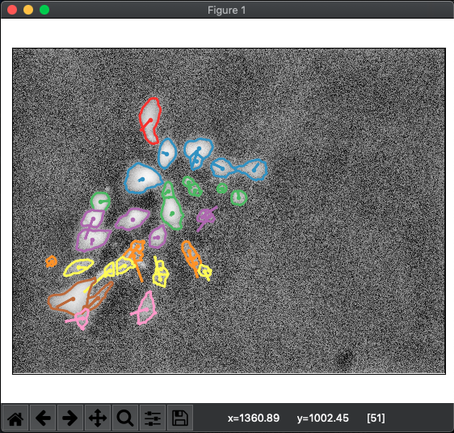

# ProgrammedMorpho2019-QuantifyingPatterning

Example code for "Engineering and quantifying spatiotemporal mosaic self-patterning"

## Installing

This script requires Python 3.6 or greater and several additional python packages.
It is recommended to install and test the code in a virtual environment for
maximum reproducibility:

```{bash}
# Create the virtual environment
python3 -m venv ~/morpho_env
source ~/morpho_env/bin/activate

# Install the required packages
pip3 install -r requirements.txt
```

The code below assumes that `python3` refers to the python binary installed in
the virtual environment.

## Usage

To run the tracking algorithm on a single folder, do:

```{bash}
python3 track_by_overlap.py [/path/to/folder]
```

To supply a user determined threshold to segment the images, do:

```{bash}
python3 track_by_overlap.py -t [threshold] [/path/to/folder]
```

Other options are available through the command line help:

```{bash}
python3 track_by_overlap.py -h
```

## Segmentation Examples

This repository contains the images to reproduce the panels in **Figure 2**. To
segment the 5 examples frames of the 25% labeled colony:

```{bash}
python3 track_by_overlap.py example_25pct
```

Which should produce the following plot while segmenting frame 1:



The segmented frames 1, 3, and 5 correspond to the panels in **Figure 2A**.

To segment the example frames of the 1%, 5%, and 10% labeled colonies:

```{bash}
python3 track_by_overlap.py -t 0.05 example_1pct
python3 track_by_overlap.py -t 0.05 example_5pct
python3 track_by_overlap.py -t 0.05 example_10pct
```

The first segmented frame of each folder corresponds to the panels in **Figure 2B**.
